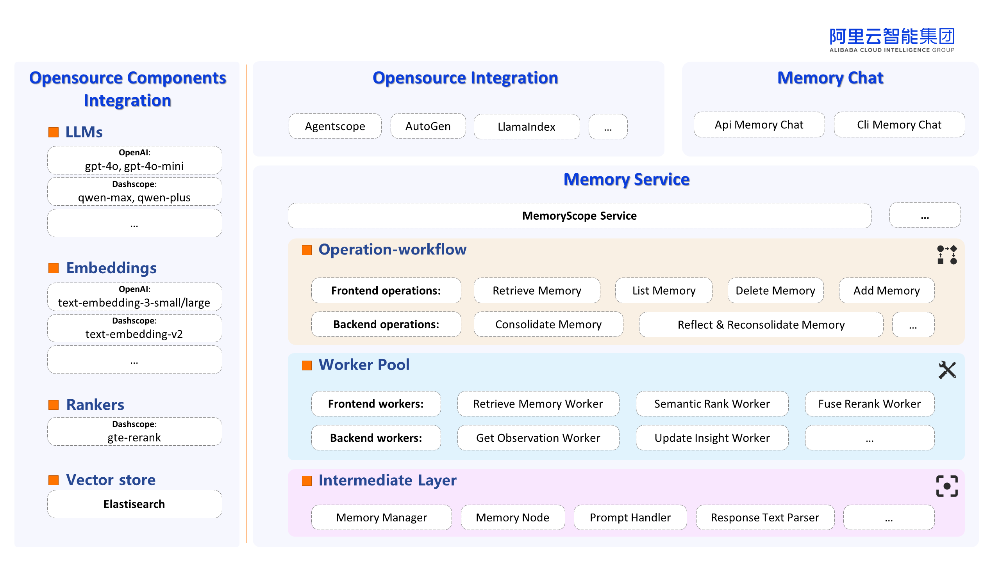

English | [**中文**](./README_ZH.md)

# MemoryScope

<p align="left">
  
</p>

Equip your LLM chatbot with a powerful and flexible long term memory system.

----
## News

- **[2024-07-29]** We release MemoryScope v0.1.0.2 now, which is also available in [PyPI](https://pypi.org/simple)!
----
## What is MemoryScope？

MemoryScope is a powerful and flexible long term memory system for LLM chatbots. It consists 
of a memory database and three customizable system operations, which can be flexibly combined to provide 
robust long term memory services for your LLM chatbot.

💾 Memory Database:
- MemoryScope comes with an *ElasticSearch (ES)* vector database to store all the 
memory pieces recorded in the system.

🛠️ System operations:
- Memory Retrieval: Upon arrival of a user query, this operation returns the semantically related memory pieces 
and/or those from the corresponding time if the query involves reference to time.
- Memory Consolidation: This operation takes in a batch of user queries and returns important user information
extracted from the queries as consolidated *observations* to be stored in the memory database.
- Reflection and Re-consolidation: At regular intervals, this operation performs reflection upon newly recorded *observations*
to form and update *insights*. Then, memory re-consolidation is performed to ensure contradictions and repetitions
among memory pieces are properly handled.

### Framework
<p align="left">
  
</p>

### Main Features

⚡ Low response-time (RT) for the user:
- Backend operations (Memory Consolidation, Reflection and Re-consolidation) are decoupled from the frontend operation
 (Memory Retrieval) in the system.
- While backend operations are usually (and are recommended to be) queued or executed at regular intervals, the 
system's response time (RT) for the user depends solely on the frontend operation, which is only ~500ms.

🌲 Hierarchical and coherent memory:
- The memory pieces stored in the system are in a hierarchical structure, with *insights* being the high level information
from the aggregation of similarly-themed *observations*.
- Contradictions and repetitions among memory pieces are handled periodically to ensure coherence of memory.
- Fictitious contents from the user are filtered out to avoid hallucinations by the LLM.

⏰ Time awareness:
- The system is time sensitive when performing both Memory Retrieval and Memory Consolidation. Therefore, it can retrieve
accurate relevant information when the query involves reference to time.


## 🚀 Installation
For installation, please refer to [Installation.md](docs/Installation.md). 

### One-key Demo Run

Run `sudo docker run -it --rm --net=host memoryscope/memoryscope` to launch memoryscope cli demo.

## Example Usages
- [Simple Usages (Quick Start)](./examples/api/simple_usages_en.ipynb)
- [CLI with a MemoryScope Chatbot](./examples/cli/dash_cli_cn1.sh)
- [Advanced Customization](./examples/api/advanced_customization_en.ipynb)


## 💡 Contribute

Contributions are always encouraged!

We highly recommend install pre-commit hooks in this repo before committing pull requests.
These hooks are small house-keeping scripts executed every time you make a git commit,
which will take care of the formatting and linting automatically.
```shell
poetry install --with dev
pre-commit install
```


## 📖 Citation

Reference to cite if you use MemoryScope in a paper:

```
@software{MemoryScope,
author = {},
month = {08},
title = {{MemoryScope}},
url = {https://github.com/modelscope/MemoryScope},
year = {2024}
}
```