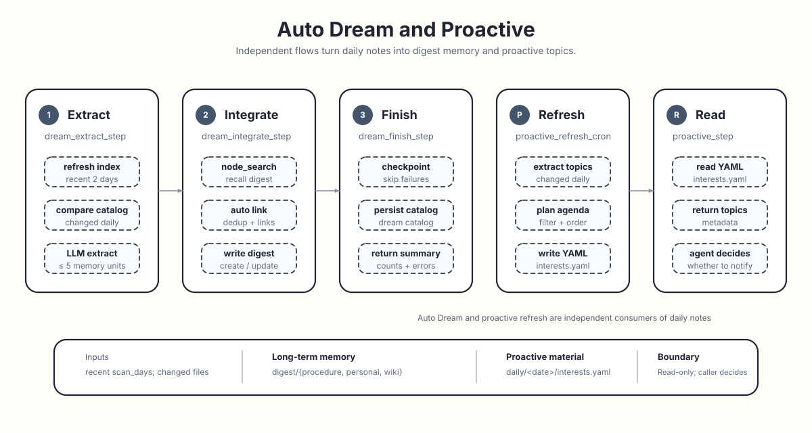

<p align="center">
 
</p>

<p align="center">
  <a href="https://pypi.org/project/reme-ai/"></a>
  <a href="https://pypi.org/project/reme-ai/"></a>
  <a href="https://pepy.tech/project/reme-ai/"></a>
  <a href="https://github.com/agentscope-ai/ReMe"></a>
  <a href="./LICENSE"></a>
  <a href="https://reme.agentscope.io"></a>
  <a href="./README.md"></a>
  <a href="./README_ZH.md"></a>
  <a href="https://github.com/agentscope-ai/ReMe"></a>
  <a href="https://deepwiki.com/agentscope-ai/ReMe"></a>
</p>

<p align="center">
<a href="https://trendshift.io/repositories/20528" target="_blank"></a>
</p>

<p align="center">
  <strong>A local-first, self-evolving personal knowledge base for AI agents.</strong><br>
</p>

> Previous versions: [0.3.x](https://github.com/agentscope-ai/ReMe/tree/reme_v3) ·
> [0.2.x](https://github.com/agentscope-ai/ReMe/tree/v0.2.0.6) ·
> [MemoryScope](https://github.com/agentscope-ai/ReMe/tree/memoryscope_branch)

## ✨ Why ReMe?

🧠 ReMe turns conversations and resources into readable, editable, searchable, and interconnected Markdown memory. Agents
such as QwenPaw and DeepSeek Harness can share the same workspace to retrieve, maintain, and evolve knowledge, while
users retain control of the durable files.

- **Memory as File, File as Memory**: ReMe stores durable memory as ordinary Markdown with frontmatter and wikilinks.
  Users and agents can inspect, edit, move, sync, and back it up with familiar tools, while indexes and generated
  metadata remain rebuildable.
- **Self-evolving knowledge base**: ReMe progressively turns conversations and resources into daily notes and long-term
  knowledge, preserving sources while refining facts, preferences, procedures, and relationships over time.
- **Recall is precise and context-aware.** BM25, optional embeddings, and wikilink expansion retrieve relevant
  line-level passages and their relationships without loading the entire knowledge base into the agent context.
- **One memory workspace works across agents.** Personal assistants, coding agents, and other agent runtimes can share
  the same local workspace through native integrations, SKILL.md, CLI, HTTP, MCP, or Python APIs.

<p align="center">
  
</p>

## 📰 Latest Updates

- [2026.08] - Published [`@agentscope-ai/reme`](https://www.npmjs.com/package/@agentscope-ai/reme), providing native
  ReMe memory integrations for DeepSeek Harness and OpenClaw plus a shared TypeScript HTTP client.
- [2026.08] - Published the [ReMe blog](https://reme.agentscope.io/en/reme-blog), an end-to-end introduction to its local-first memory
  architecture, self-evolving workflows, hybrid search, proactive discovery, and benchmark results.
- [2026.08] - [Experience-driven enhancement method](https://reme.agentscope.io/en/benchmarks/toolmemory) of agent tool-use execution built
  on ReMe is available on [arXiv:2608.03403](https://arxiv.org/abs/2608.03403).
- [2026.07] - Introduced optional plugins: [Daily Paper](https://reme.agentscope.io/en/plugins/daily-paper) for paper discovery and
  analysis, and [Auto Fin](https://reme.agentscope.io/en/plugins/auto-fin) for researching the latest 24 hours of topic-related CLS news
  with local-memory search and validated historical wikilinks.
- [2026.07] - Our
  paper [Remember Me, Refine Me: A Dynamic Procedural Memory Framework for Experience-Driven Agent Evolution](https://aclanthology.org/2026.findings-acl.829/)
  has been accepted to Findings of ACL 2026.

## 🚀 Quick Start

### Installation

ReMe requires Python 3.11+.

Install from pip:

```bash
pip install "reme-ai[core]"
```

Install from source:

```bash
git clone https://github.com/agentscope-ai/ReMe.git
cd ReMe
pip install -e reme_studio -e ".[core]"
cd reme_studio
npm ci
npm run build:static
cd ..
```

The static build requires Node.js 22.13 or newer and makes Studio available from the source tree.

### Environment Variables

Configure environment variables when you want LLM-powered memory evolution or embedding retrieval. Embeddings are
disabled by default, so the default setup does not start an embedding model or require an embedding API key.

```bash
cat > .env <<'EOF'
# Optional: used only after embedding components are explicitly enabled in the config.
# EMBEDDING_API_KEY=sk-xxx
# EMBEDDING_BASE_URL=https://dashscope.aliyuncs.com/compatible-mode/v1

# Required for auto_memory, auto_resource, and auto_dream.
LLM_API_KEY=sk-xxx
LLM_BASE_URL=https://dashscope.aliyuncs.com/compatible-mode/v1
EOF
```

Basic file operations, BM25 search, wikilink traversal, and reading proactive topics can run without LLM credentials.

> [!NOTE]
> To enable embedding-based semantic retrieval, uncomment `components.as_embedding` and
> `components.embedding_store` in [`reme/config/default.yaml`](reme/config/default.yaml), then change
> `components.file_store.default.embedding_store` from `""` to `default`. See the
> [memory search guide](docs/en/memory_search.md) for details.

### Start the Service

```bash
reme start
```

The default service address is `127.0.0.1:2333`. If the port is occupied, specify another port:

```bash
reme start service.port=8181
# reme start workspace_dir=/tmp/reme-demo service.port=8181
```

```bash
reme version
reme health_check
reme help
curl -s http://127.0.0.1:2333/version -H 'Content-Type: application/json' -d '{}'
```

### 5-Minute Memory Demo

With the service running, write a memory node, let ReMe index it, then retrieve it:

```bash
reme write \
  path=digest/wiki/quick-start-demo \
  name="Quick Start Demo" \
  description="A first ReMe memory node" \
  content="# Quick Start Demo

ReMe stores agent memory as readable Markdown.

Related: [[digest/wiki/memory-as-file.md]]"

reme search query="agent memory markdown" limit=5
reme read path=digest/wiki/quick-start-demo start_line=1 end_line=20
```

The generated file is ordinary Markdown with frontmatter:

```markdown
---
name: Quick Start Demo
description: A first ReMe memory node
---

# Quick Start Demo

ReMe stores agent memory as readable Markdown.

Related: [[digest/wiki/memory-as-file.md]]
```

### ReMe Studio (Optional)

The `core` installation includes Studio. After starting ReMe, open <http://127.0.0.1:2333/> to browse, edit, and search
the workspace. To add Studio to a base installation, use `pip install "reme-ai[web]"`. See the
[ReMe Studio guide](https://reme.agentscope.io/en/workspace/studio) for source builds, configuration, and development.

## 🤝 Use ReMe with Your Agent

ReMe can run as a local memory service accessed through the CLI, HTTP API, or MCP server, or it can be embedded in the
host process through its Python API. Host integrations can add memory guidance, recall, and capture to the agent
lifecycle according to the capabilities of each runtime.

| Agent                          | Recommended path                                                                                                                         | Available after integration                                                                             |
| ------------------------------ | ---------------------------------------------------------------------------------------------------------------------------------------- | ------------------------------------------------------------------------------------------------------- |
| **DeepSeek Harness**           | Install [`@agentscope-ai/reme`](typescript/README.md#deepseek-harness) with `dsh plugin --profile web add @agentscope-ai/reme`. | Long-term memory guidance, the `reme_search` tool, and automatic capture of completed main-agent turns. |
| **OpenClaw**                   | Install [`@agentscope-ai/reme`](typescript/README.md#openclaw) with `openclaw plugins install @agentscope-ai/reme`.             | Native memory tools, recall before user-triggered runs, and automatic turn capture.                     |
| **QwenPaw**                    | Embed ReMe in-process through its Python API.                                                                                            | Reuse the host lifecycle and model config while keeping memory local and file-based.                    |
| **Claude Code**                | Start the streamable HTTP MCP service and install [the ReMe plugin](integrations/claude_code/reme).                                      | MCP recall tools, the `reme-memory` skill, and a Stop hook that records sessions automatically.         |
| **Hermes**                     | Start the HTTP service and install [the ReMe provider](integrations/hermes_agent).                                                       | Recall before model calls and asynchronous `auto_memory` after each completed turn.                     |
| **Codex and other CLI agents** | Install or copy the [ReMe Memory skill](skills/reme_memory/SKILL.md).                                                                    | Search, read, and write memory through the CLI; automatic capture requires host lifecycle integration.  |

<p align="center"><b>Integration demos</b></p>

<table>
  <tr>
    <td align="center"></td>
    <td width="45%" align="center"><b>Auto Memory</b></td>
    <td width="45%" align="center"><b>Auto Dream</b></td>
  </tr>
  <tr>
    <td align="center"><b>QwenPaw</b></td>
    <td width="45%">
      
    </td>
    <td width="45%">
      
    </td>
  </tr>
  <tr>
    <td align="center"><b>Claude Code</b></td>
    <td width="45%">
      
    </td>
    <td width="45%">
      
    </td>
  </tr>
</table>

## 🧠 How ReMe Works

> Memory as File, File as Memory.

ReMe treats **memory as files**, progressively processing filtered conversation source records and external resources
from `session/` and `resource/` into `daily/`, then `digest/`. The default workspace is `.reme/` under the current
directory; `workspace_dir=...` selects a different user-owned location.

### Workspace Layout

```text
<workspace_dir>/
├── metadata/       # Rebuildable indexes, graphs, catalogs, and caches
├── session/        # Conversation source records and agent sessions
│   ├── dialog/
│   │   └── <session_id>.jsonl  # Source messages saved by auto_memory
│   └── claude_code/
│       └── <session_id>.jsonl  # ReMe copy used by auto_memory_cc
├── mem_session/    # Generated agent-wrapper sessions/config, not user memory
│   ├── agentscope/
│   ├── claude_config/
│   └── codex/
├── resource/            # External raw materials
│   ├── <resource>.<ext>  # Root-level files enter today's daily layer
│   └── YYYY-MM-DD/
│       └── <resource>.<ext>
├── daily/               # Lightly processed memory: daily facts, conversation summaries, resource readings
│   ├── YYYY-MM-DD.md
│   └── YYYY-MM-DD/
│       ├── <generated_name>.md  # Topic-named conversation or resource card
│       └── interests.yaml
└── digest/              # Long-term memory: personal facts, procedural experience, knowledge nodes
    ├── personal/
    │   └── {topic/event}.md
    ├── procedure/
    │   └── {topic/event}.md
    └── wiki/
        └── {topic/event}.md
```

<p align="center">
  
</p>

### Memory Lifecycle

ReMe follows a capture → index → consolidate → recall loop. Workspace files remain the durable source of truth;
everything under `metadata/` is rebuildable.

| Capability                                  | Entry point                                     | What it does                                                                                                                                                   | Output                                                        |
| ------------------------------------------- | ----------------------------------------------- | -------------------------------------------------------------------------------------------------------------------------------------------------------------- | ------------------------------------------------------------- |
| [`auto_memory`](docs/en/auto_memory.md)     | Agent hook or `reme auto_memory`                | Distills useful conversation facts while preserving a filtered conversation source record.                                                                     | `session/dialog/*.jsonl`, `daily/<date>/<generated-name>.md`  |
| [`auto_resource`](docs/en/auto_resource.md) | Resource watcher or `reme auto_resource`        | Turns files under `resource/` into source-linked, content-named daily cards.                                                                                   | `daily/<date>/<resource-card>.md`                             |
| [`auto_index`](docs/en/memory_search.md)    | Background watcher or `reme reindex`            | The watcher ingests Markdown from `daily/` and `digest/`; `reindex` only rebuilds BM25 and embeddings from already-ingested chunks.                            | Searchable chunks, BM25, wikilink graph, and optional vectors |
| [`auto_dream`](docs/en/auto_dream.md)       | `dream_cron` or `reme auto_dream`               | By default, extracts up to five reusable units from changed files in the latest two-day window, then creates, corroborates, refines, or corrects digest nodes. | `digest/**`, `daily/<date>/interests.yaml`                    |
| [`proactive`](docs/en/proactive.md)         | `reme proactive` before an agent decides to act | Reads topics generated by `auto_dream`; the host agent decides whether and how to mention them.                                                                | Structured topics from `daily/<date>/interests.yaml`          |

<table>
  <tr>
    <td align="center" width="50%">
      
    </td>
    <td align="center" width="50%">
      
    </td>
  </tr>
  <tr>
    <td align="center" width="50%">
      
    </td>
    <td align="center" width="50%">
      
    </td>
  </tr>
</table>

Search returns matching chunks with line ranges and bounded wikilink neighbors. Optional vector results are fused with
BM25 through reciprocal rank fusion (RRF).

> [!IMPORTANT]
>
> `proactive` only reads and exposes interest topics produced by Auto Dream. It does not independently browse the web,
> send notifications, or rewrite the knowledge base; the host agent decides whether and how to act on a topic.

## 📊 Benchmarks

ReMe evaluates multi-session and long-context memory with agentic search-and-read workflows. The figures below are the
published reference runs in this repository; model, prompt, dataset, and judging details are documented with each
benchmark.

| Benchmark                                                                   | Setting      |              Sample size | Agentic score | Focus                                                              |
| --------------------------------------------------------------------------- | ------------ | -----------------------: | ------------: | ------------------------------------------------------------------ |
| **[LongMemEval cleaned-s](https://reme.agentscope.io/en/benchmarks/longmemeval)** | **Overall**  |        **500 questions** |     **89.4%** | Cross-session retrieval, knowledge updates, and temporal reasoning |
| [BEAM](https://reme.agentscope.io/en/benchmarks/beam)                             | 100K context | 20 cases / 400 questions |         66.1% | Ten types of long-context memory tasks                             |
| [BEAM](https://reme.agentscope.io/en/benchmarks/beam)                             | 1M context   | 35 cases / 700 questions |         65.0% | Ultra-long conversation settings                                   |

ReMe also achieved a **0.580 PROC score across five user personas** in the repository's
[π-Bench evaluation](https://reme.agentscope.io/en/benchmarks/pibench), 2.4% above NanoBot under the same test-model configuration. PROC
measures proactive handling of hidden intent, clarification, cross-session preferences and conventions, task
dependencies, and underspecified requests.

## 🧩 Extensions and Plugins

Plugins are optional Python distributions that contribute Component, Step, or Job backends and configuration. They are
installed separately and enabled explicitly by configuration. Daily Paper and Auto Fin are independently packaged
plugins; see the source distributions and their documentation for [Daily Paper](plugins/daily_paper/README.md) and
[Auto Fin](plugins/auto-fin/README.md).

| Plugin                                                        | Capability                                                                                                    |
| ------------------------------------------------------------- | ------------------------------------------------------------------------------------------------------------- |
| [Daily Paper](https://reme.agentscope.io/en/plugins/daily-paper) | Discover and rank papers, analyze PDFs with an agent, and generate file-native notes and a five-minute brief. |
| [Auto Fin](https://reme.agentscope.io/en/plugins/auto-fin)       | Fetch topic-related CLS news, search ReMe history, and generate wikilink-backed Markdown reports.             |

See [Plugin Management](docs/en/plugin_management.md) to install, inspect, validate, enable, and uninstall ReMe plugins.

## 📚 Documentation

These guides cover the main user workflows and the runtime contracts implemented by the current code.

| Guide                                                                     | What you will learn                                                                                 |
| ------------------------------------------------------------------------- | --------------------------------------------------------------------------------------------------- |
| [Quick Start](docs/en/quick_start.md)                                     | Install ReMe, start the service, and run the first file and memory operations.                      |
| [Configuration](docs/en/configuration.md)                                 | Configure the workspace, models, Service, Jobs, Components, plugins, and CLI overrides.             |
| [Services and Deployment](docs/en/services.md)                            | Use HTTP, SSE, MCP, and Studio while respecting the default security boundary.                       |
| [Memory as File](docs/en/memory_as_file.md)                               | Understand workspace layers, frontmatter, wikilinks, chunks, and the file-as-source-of-truth model. |
| [Auto Memory](docs/en/auto_memory.md)                                     | Preserve source conversations and distill reusable daily memory cards.                              |
| [Auto Resource](docs/en/auto_resource.md)                                 | Import supported text and image resources as source-linked daily cards.                             |
| [Auto Dream](docs/en/auto_dream.md) and [Auto Link](docs/en/auto_link.md) | Consolidate daily notes into evolving digest nodes and readable wikilink relationships.             |
| [Memory Search](docs/en/memory_search.md)                                 | Use BM25, optional vectors, RRF fusion, line-range recall, and progressive link expansion.          |
| [Proactive](docs/en/proactive.md)                                         | Read interest topics safely and integrate them into a host agent's decision flow.                   |
| [Application Scenarios](docs/en/reme_scene.md)                            | Follow concrete financial research, coding-memory, and personal knowledge-base examples.           |
| [Framework](docs/en/framework.md)                                         | Understand Application, Job, Step, Component, service, configuration, and lifecycle boundaries.     |
| [TypeScript integrations](typescript/README.md)                            | Configure the shared client and native DeepSeek Harness and OpenClaw adapters.                       |
| [CLI and Job API](docs/en/reference/cli.md)                               | Learn command syntax and use the generated default Job parameter reference.                         |
| [Operations and Recovery](docs/en/operations.md)                          | Diagnose services, maintain indexes, and back up, migrate, or recover a workspace.                   |
| [ReMe Blog](https://reme.agentscope.io/en/reme-blog)                      | Read the product story, design rationale, examples, and benchmark summary.                           |

## 🛠️ Common Commands

Run `reme help` for the full job list. Common workspace and maintenance commands are:

| Command                                   | Purpose                                                                           |
| ----------------------------------------- | --------------------------------------------------------------------------------- |
| `reme status`                             | Show stateful data-component memory estimates and process RSS.                    |
| [`reme search`](docs/en/memory_search.md) | Retrieve memory with BM25 and wikilinks by default, plus vectors when enabled.    |
| `reme read` / `reme write` / `reme edit`  | Inspect and maintain Markdown memory files.                                       |
| `reme traverse` / `reme graph_snapshot`   | Explore wikilink neighborhoods or the category-rooted digest graph.               |
| `reme chat`                               | Stream a read-only, workspace-aware agent conversation. Requires LLM credentials. |
| `reme reindex`                            | Rebuild BM25 and embedding indexes from already-ingested chunks.                  |

## 🤝 Community and Contributing

- **Issues, requests, and help**: Check [Open Issues](https://github.com/agentscope-ai/ReMe/issues) first. If there is no
  related discussion, open one with the background, expected behavior, and impact scope.
- **Code contributions**: Before making changes, read the repository's
  [contribution guide](docs/en/contributing.md). Source, schemas, and tests are the authoritative architecture and
  extension guide.
- **Documentation contributions**: Update the canonical files under `docs/en/`, `docs/zh/`, or the relevant package
  directory in this repository. The documentation site is generated from these files.
- **Commit convention**: Conventional Commits are recommended, for example `feat(search): add link expansion option` or
  `docs(zh): update quick start`.
- **Pre-submit checks**: Before submitting a PR, try to run `pre-commit run --all-files` and `pytest`. If tests that
  depend on LLMs, embeddings, or external services cannot run, explain that in the PR.
- **Documentation**: Visit [reme.agentscope.io](https://reme.agentscope.io).

### Contributors

Thanks to everyone who has contributed to ReMe:

<a href="https://github.com/agentscope-ai/ReMe/graphs/contributors">
  
</a>

## 📄 Citation

```bibtex
@software{ReMe2026,
  title = {Remember me, Refine me: Memory Management Kit for Agents},
  author = {ReMe Team},
  url = {https://reme.agentscope.io},
  year = {2026}
}
```

## ⚖️ License

This project is open source under the Apache License 2.0. See [LICENSE](./LICENSE) for details.
