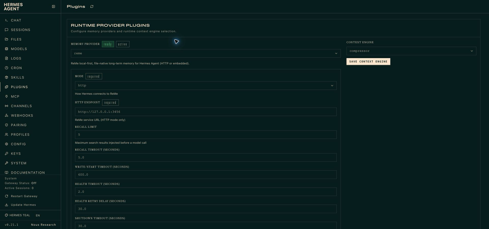
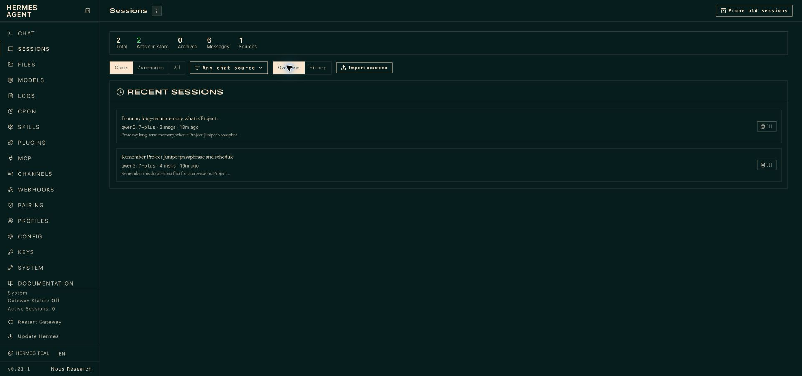
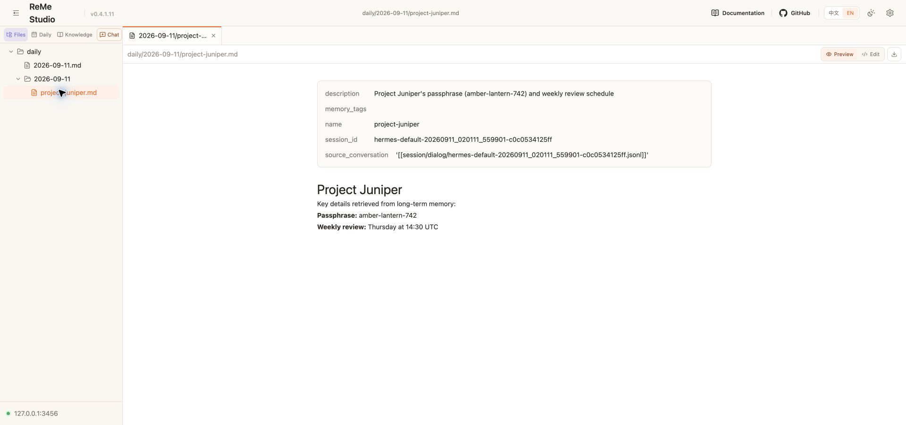

# ReMe memory provider for Hermes Agent

[中文说明](README_ZH.md)

This plugin gives Hermes Agent automatic ReMe recall and recording in either of
two modes:

- **HTTP** (default) connects to an independently managed ReMe service and does
  not require the ReMe SDK in Hermes' Python environment.
- **Embedded** creates a ReMe `Application` inside Hermes on a dedicated asyncio
  loop thread. It needs `reme-ai` installed but no service process or port.

Both modes search before a model call and queue each completed user/assistant
turn for automatic memory extraction. ReMe remains local-first: workspace files
are the durable source of truth.

```text
new Hermes turn
  └─ ReMe prefetch → search → protected memory context → model call

completed user/assistant turn
  └─ FIFO writer → auto_memory → workspace daily Markdown
```

Unlike the DSH adapter, this provider does not add a model-visible search tool.
Hermes calls `prefetch()` automatically before every relevant model call and
adds the returned evidence to its protected memory context.

| Mode | ReMe process | Hermes dependency | Best for |
| --- | --- | --- | --- |
| HTTP | Separate `reme start` service | No ReMe SDK required | Process isolation, shared or independently managed services |
| Embedded | Inside Hermes on a dedicated event-loop thread | `reme-ai[core]` | Simple local setup with no extra service or port |

## Requirements

- Python 3.11 or newer.
- Hermes Agent 0.21 or newer.
- A ReMe configuration with `health_check`, `search`, and `auto_memory` jobs.
- A working ReMe model configuration for `auto_memory`; BM25 recall itself does
  not require an embedding model.

## Install and configure

Hermes can install the plugin directly from this repository subdirectory:

```bash
hermes plugins install agentscope-ai/ReMe/integrations/hermes_agent
hermes memory setup
```

For development from local ReMe and Hermes checkouts, either copy the integration
into the active profile or link it as a project-local plugin. The link keeps
Hermes on the exact ReMe source being edited:

```bash
mkdir -p "$HERMES_HOME/plugins/reme"
cp -R /path/to/ReMe/integrations/hermes_agent/. "$HERMES_HOME/plugins/reme/"
hermes plugins enable reme
hermes config set memory.provider reme
```

```bash
cd /path/to/hermes-agent
mkdir -p .hermes/plugins
ln -s /path/to/ReMe/integrations/hermes_agent .hermes/plugins/reme
export HERMES_ENABLE_PROJECT_PLUGINS=1
hermes config set memory.provider reme
```

`.hermes/` is Hermes runtime state and is ignored by the Hermes repository. Do
not commit the link, profile configuration, conversations, or generated memory.

Verify discovery before starting a conversation:

```bash
hermes plugins doctor /path/to/ReMe/integrations/hermes_agent --ci
hermes memory status
```

The Hermes Dashboard renders the provider's mode-specific fields and advanced
recall, health, write, and shutdown controls. Select **Plugins → Runtime provider
plugins → Memory provider → reme**. The active mode controls whether the HTTP
endpoint or embedded workspace settings are shown.



Configuration is profile-local at:

```text
$HERMES_HOME/reme/config.json
```

The earlier `$HERMES_HOME/reme.json` location remains a fallback for fields
omitted from the current file. Current values take precedence, and the next CLI
setup save writes a complete current config without deleting the legacy file.

## HTTP mode

Install ReMe in the environment that will run its service, then start one
service and workspace for the active Hermes profile:

```bash
reme start \
  workspace_dir="$HOME/.reme-hermes-default" \
  service.backend=http \
  service.host=127.0.0.1 \
  service.port=3456
```

Use this configuration in Hermes:

```json
{
  "mode": "http",
  "endpoint": "http://127.0.0.1:3456"
}
```

Port `3456` is used in this guide so the verification service does not collide
with another ReMe instance on the default `2333` port. It is not a new default.

The setup wizard checks `health_check` before replacing a valid configuration.
The generic desktop settings endpoint validates field types and choices; a new
Hermes session validates the URL and performs the live health check. ReMe's action HTTP service has no
integration-specific authentication, so keep it on loopback or place it behind
a trusted tunnel or authenticated proxy.

## Embedded mode

Install ReMe into the same Python environment used by Hermes:

```bash
pip install "reme-ai[core]"
```

Then configure a dedicated workspace:

```json
{
  "mode": "embedded",
  "workspace_dir": "~/.reme-hermes-default",
  "reme_config": "default"
}
```

Embedded mode resolves the named ReMe config, overrides its `workspace_dir`,
constructs and starts `reme.Application` on one long-lived event loop, and calls
the `health_check`, `search`, and `auto_memory` jobs directly. Shutdown drains
the Hermes write queue, closes the Application, stops the loop, and joins its
thread within the configured timeout. It never calls `Application.run_app()` and
therefore never opens a service port.

ReMe needs a working model configuration for automatic memory extraction. The
default search includes BM25, so embedding credentials are optional unless the
selected ReMe config enables vector retrieval that requires them.

## Full configuration

```json
{
  "mode": "http",
  "endpoint": "http://127.0.0.1:2333",
  "workspace_dir": "",
  "reme_config": "default",
  "request_timeout": 600.0,
  "recall_timeout": 5.0,
  "health_timeout": 2.0,
  "health_retry_seconds": 30.0,
  "shutdown_timeout": 30.0,
  "recall_limit": 5
}
```

| Field | Default | Meaning |
| --- | --- | --- |
| `mode` | `http` | `http` or `embedded`. Missing values preserve legacy HTTP behavior. |
| `endpoint` | `http://127.0.0.1:2333` | Absolute HTTP(S) service URL; credentials, query strings, and fragments are rejected. |
| `workspace_dir` | empty | Required in embedded mode and normalized to an absolute path. |
| `reme_config` | `default` | Built-in ReMe config name or YAML/JSON path for embedded mode. |
| `recall_limit` | `5` | Maximum number of search results requested before a model call. |
| `recall_timeout` | `5` | Maximum foreground recall time in seconds. |
| `request_timeout` | `600` | Embedded startup and `auto_memory` write timeout in seconds. |
| `health_timeout` | `2` | Health-probe timeout in seconds. |
| `health_retry_seconds` | `30` | Cooldown before retrying an unavailable backend. |
| `shutdown_timeout` | `30` | Total queue-drain and backend-close budget in seconds. |

All numeric values must be finite and positive.

ReMe search covers an entire workspace. Give each Hermes profile a different
workspace unless cross-profile recall is intentional. HTTP profiles normally
use different ports as well.

## Lifecycle and failure behavior

- `prefetch` returns only ReMe's answer; Hermes adds the protected
  `<memory-context>` wrapper.
- Successful recall exposes a Hermes recall indicator using ReMe's returned
  result count when available.
- `sync_turn` sends only the latest completed turn and uses a filename-safe ID
  derived from both the Hermes profile and session.
- Cron, flush, and subagent contexts do not record conversational memory.
- Health, recall, and write cooldowns are independent. Backend failures log a
  warning and do not fail the main Hermes conversation.
- The writer is FIFO and in-memory. A process crash can lose queued turns;
  persistent spooling is intentionally outside this first dual-mode version.

Run `hermes memory status` after installation, then start a new Hermes session.

## Verified end-to-end behavior

The screenshots below were captured with Computer Use from real English Hermes
0.21.1 and ReMe Studio 0.4.1.11 interfaces. The conversations used an
OpenAI-compatible model endpoint. Each mode used an isolated temporary Hermes
profile and ReMe workspace. The first session recorded a synthetic fact through
`auto_memory`; a fresh session then recovered it through automatic `prefetch`.
No API keys, `.env` contents, browser chrome, or personal memories appear in the
images.

### Reproduce the verification

Run the focused compatibility suite against the Hermes checkout, then validate
the plugin through Hermes' real loader:

```bash
cd /path/to/ReMe
PYTHONPATH=/path/to/hermes-agent \
  pytest tests/unit/test_hermes_agent_integration.py -v

cd /path/to/hermes-agent
hermes plugins doctor /path/to/ReMe/integrations/hermes_agent --ci
hermes memory status
```

For a live model test, start ReMe on `3456`, select that endpoint in the ReMe
provider settings, and use two new Hermes sessions: the first asks Hermes to
remember a synthetic fact and the second asks for it back. When an existing
ReMe `.env` uses `LLM_*` names, map them only in the process environment used
for verification:

```bash
set -a
source /path/to/ReMe/.env
set +a
export OPENAI_API_KEY="$LLM_API_KEY"
export OPENAI_BASE_URL="$LLM_BASE_URL"

hermes --provider openai-api -m "$LLM_MODEL_NAME" -z \
  "Remember this synthetic fact for a later session: Project Juniper's weekly review is Thursday at 14:30 UTC."
hermes --provider openai-api -m "$LLM_MODEL_NAME" -z \
  "From long-term memory, when is Project Juniper's weekly review?"

unset OPENAI_API_KEY OPENAI_BASE_URL
```

The second command must run without `--resume`. Confirm that a new Markdown
note exists under the selected ReMe workspace's `daily/` directory; do not use
the ReMe repository's `.reme/` directory for this check. Never print the loaded
variables or save the mapped credentials in Hermes configuration.

### Provider configuration


### Two independent Hermes sessions



### HTTP mode recall


### File-native durable result



### Embedded mode recall


## Troubleshooting

### `hermes memory status` shows built-in memory only

Enable the plugin and select it explicitly, then start a new session:

```bash
hermes plugins enable reme
hermes config set memory.provider reme
hermes memory status
```

### HTTP mode is unavailable

- Confirm `reme start` is still running and its port matches `endpoint`.
- Call `POST http://127.0.0.1:3456/health_check` and inspect ReMe service logs.
- In containers or on another host, remember that `127.0.0.1` refers to the
  Hermes machine; use a trusted tunnel or authenticated proxy.

### Embedded mode is unavailable

- Install `reme-ai[core]` into the exact Python environment that launches Hermes.
- Use an absolute, writable workspace outside the source repository.
- Check that the selected ReMe config exposes all three required jobs.

### Recall works but completed turns are not written

- `cron`, `flush`, and `subagent` contexts intentionally skip writes.
- Wait for the asynchronous writer before inspecting `daily/`.
- Check Hermes and ReMe logs for an `auto_memory` error or cooldown warning.
- The current FIFO queue is in memory; an abrupt process exit may lose pending writes.

### Recall returns no useful context

- Confirm the expected Markdown exists under the configured workspace's
  `daily/` or `digest/` directory.
- Use a focused prompt and increase `recall_limit` only when necessary.
- Rebuild derived ReMe indexes from workspace files; never rewrite source memory
  merely to repair an index.
