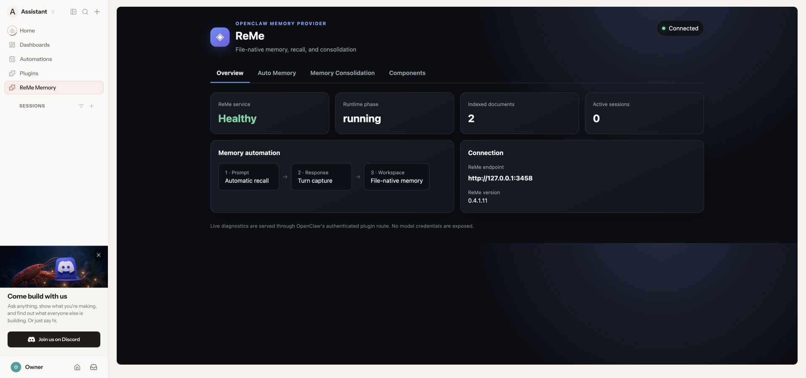
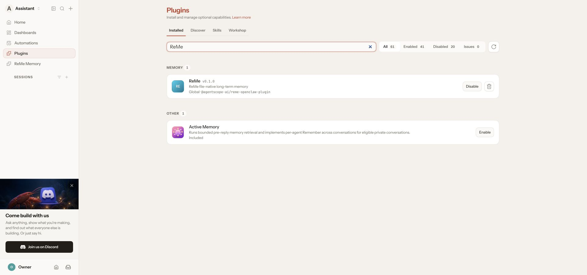
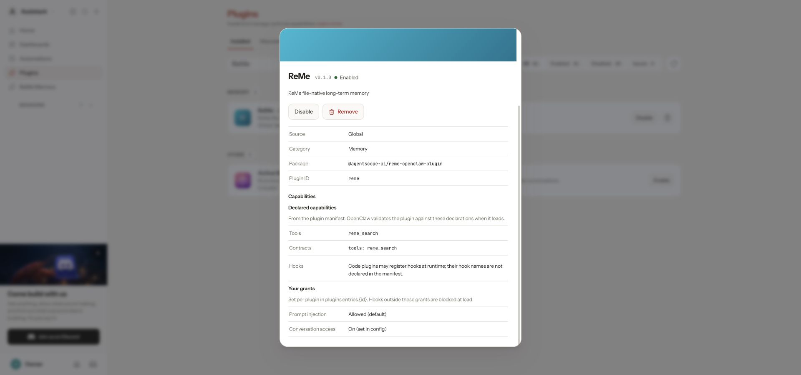
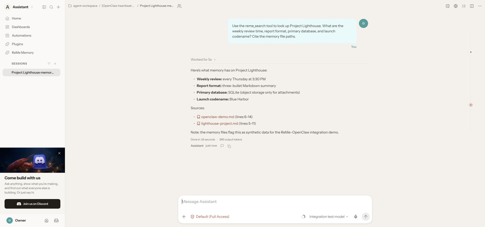
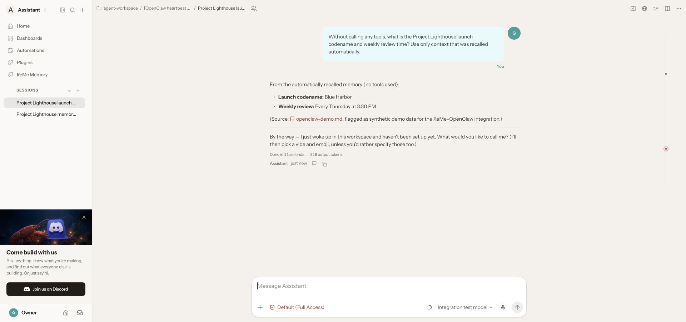
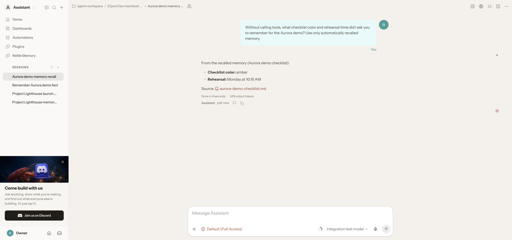
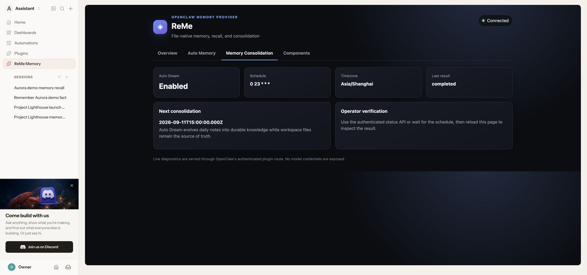

# OpenClaw 的 ReMe 长期记忆插件

[English](./README.md)

ReMe 为 OpenClaw 提供文件原生的长期记忆，持久数据保存在用户拥有的 workspace 中。本集成使用 OpenClaw
公开插件 SDK、memory slot、带认证的 Control UI、服务生命周期、对话 Hook 和工具协议。



## 能力

- `reme_search` 执行显式搜索，并返回可追溯到文件的结果。
- `before_prompt_build` 在根 Agent 的对话轮次前自动召回相关记忆。
- `agent_end` 将原始用户/助手消息按会话串行、分批提交到后台。
- `session_end` 刷新会话边界；服务退出会在有限时间内排空待处理任务。
- Auto Dream 按配置时区每日运行一次，将 daily 记录整理为长期 digest 知识。
- OpenClaw 侧边栏的 **ReMe Memory** 页面展示服务健康、自动记忆、Auto Dream 和组件状态。

召回内容使用 `<reme-context>` 包裹、标记为不可信历史数据，并进行结束标签转义。默认排除子 Agent、Cron、
Heartbeat、Memory 和 Overflow 触发的运行。

## 兼容性与前置条件

- OpenClaw `2026.9.3` 或更高版本。
- Node.js 24 版本线需要 `24.16.0+`；Node.js 26 版本线需要 `26.1.0+`。
- Python 3.11+，以及提供 `search`、`auto_memory`、`auto_dream`、`health_check`、`status` 的 ReMe HTTP 服务。
- ReMe 的自动记忆和 Auto Dream Job 已配置可用模型。

插件本身不会接收 LLM API Key。模型凭据应保留在 ReMe/OpenClaw 配置边界中，禁止写入此包、截图或提交的配置。

## 1. 启动 ReMe

安装 ReMe，选择用户拥有的 workspace，并仅监听 loopback。若本机已有 ReMe 实例，可使用 `3458`：

```bash
pip install "reme-ai[core]"
reme start \
  workspace_dir=/absolute/path/to/reme-workspace \
  service.host=127.0.0.1 \
  service.port=3458
```

不读取或输出模型配置即可验证服务：

```bash
curl -fsS -X POST http://127.0.0.1:3458/health_check \
  -H 'Content-Type: application/json' -d '{}'
```

ReMe HTTP 本身不增加 API Key 认证。应保持 loopback，或在可信的认证代理之后部署。

## 2. 安装插件

安装发布包：

```bash
openclaw plugins install clawhub:@agentscope-ai/reme-openclaw-plugin
```

从本仓库构建并安装实际测试过的归档：

```bash
cd /path/to/ReMe/integrations/openclaw
npm ci
npm run build
npm pack
openclaw plugins install --force ./agentscope-ai-reme-openclaw-plugin-0.1.0.tgz
```

安装后重启 Gateway。在 **Settings → Plugins** 搜索 `ReMe`，应看到插件已启用、分类为 Memory，并暴露
`reme_search`。



详情页还会显示对话权限和工具契约；插件配置中没有密钥字段。



## 3. 配置 OpenClaw

将以下内容加入 OpenClaw 的生效配置，然后重启 Gateway：

```json
{
  "plugins": {
    "slots": { "memory": "reme" },
    "entries": {
      "reme": {
        "enabled": true,
        "hooks": { "allowConversationAccess": true },
        "config": {
          "endpoint": "http://127.0.0.1:3458",
          "language": "zh",
          "autoRecall": true,
          "autoMemoryEnabled": true,
          "autoMemoryInterval": 5,
          "autoDreamEnabled": true,
          "dreamCron": "0 23 * * *",
          "timezone": "Asia/Shanghai"
        }
      }
    }
  }
}
```

`config` 外的两个设置都不可省略：`plugins.slots.memory` 让 ReMe 成为当前记忆提供方；
`allowConversationAccess` 授权非内置插件读取已完成的对话。缺少后者时，显式搜索可能正常，但自动记忆不会工作。

验证配置和实际运行时：

```bash
openclaw config validate --json
openclaw plugins inspect reme --runtime --json
openclaw gateway status
```

运行时结果应包含 `status: loaded`、`memorySlotSelected: true`、`reme_search`、三个 typed hook、一个 service 和一个
带认证的 HTTP route。当前 `plugins validate` 面向仅声明 authoring metadata 的 tool/feature 插件；这个混合生命周期插件
应以 runtime inspect 为准。

## 配置参考

| 配置项                | 默认值                  | 作用                                 |
| --------------------- | ----------------------- | ------------------------------------ |
| `endpoint`            | `http://127.0.0.1:2333` | ReMe HTTP 服务地址                   |
| `language`            | `en`                    | 记忆指引语言：`en` 或 `zh`           |
| `autoRecall`          | `true`                  | 根 Agent 对话前自动召回              |
| `searchLimit`         | `5`                     | 搜索结果上限                         |
| `recallMinScore`      | `0`                     | 自动召回最低分                       |
| `autoMemoryEnabled`   | `true`                  | 捕获完成的用户/助手轮次              |
| `autoMemoryInterval`  | `5`                     | 每批完成轮次数                       |
| `autoDreamEnabled`    | `true`                  | 启用定时记忆整理                     |
| `dreamCron`           | `0 23 * * *`            | 每日计划（`分钟 小时 * * *`）        |
| `dreamHint`           | 空                      | 传给 `auto_dream` 的可选指引         |
| `rootAgentsOnly`      | `true`                  | 排除子 Agent 和非对话触发            |
| `timezone`            | `Asia/Shanghai`         | 批次和计划使用的 IANA 时区           |
| `requestTimeoutMs`    | `10000`                 | 召回、搜索和状态请求超时             |
| `backgroundTimeoutMs` | `3600000`               | 自动记忆和 Auto Dream 超时           |
| `shutdownTimeoutMs`   | `5000`                  | Gateway 退出时尽力排空任务的时间预算 |

失败的捕获批次会在进程内保留以便重试。持久数据只由 ReMe 写入其 workspace；插件队列和诊断均为可重建的进程状态。

## 4. 使用与验证

### 状态前端

在 OpenClaw 侧边栏打开 **ReMe Memory**。页面通过 Gateway 认证路由 `/plugins/reme/status/` 提供。由于 OpenClaw
会把外部插件页放入无脚本沙箱，该页采用服务端渲染和纯 CSS 标签页，保持当前宿主安全边界。页面展示 endpoint 和组件
指标，但不展示模型凭据或对话正文。

### 显式搜索

输入：`Use reme_search to look up Project Lighthouse.` 对话中应出现 **ReMe Search** 工具卡片，回答应引用
workspace 相对路径。



### 自动召回

新建会话，询问一条已有记忆可回答的问题，并加上 `Without calling tools`。若没有工具卡片但回答正确，即证明
`before_prompt_build` 已自动注入召回上下文。



### 跨会话自动记忆

快速验证时可暂时把 `autoMemoryInterval` 设为 `1`。在一个会话中告诉 OpenClaw 一条独特的虚构事实，等待助手轮次和
ReMe 后台任务完成，再在另一个全新会话中禁止工具并询问该事实；同时确认 ReMe workspace 下生成了新的 Markdown。



测试结束后建议恢复较大的间隔，以减少模型调用。

### Auto Dream

等待 `dreamCron`，或者在本机通过认证的运维端点执行一次真实整理：

```bash
curl -fsS -X POST http://127.0.0.1:18799/plugins/reme/status/api/dream \
  -H 'Content-Type: application/json'
```

刷新 **ReMe Memory → Memory Consolidation**，确认 `Last result: completed`，并检查 ReMe workspace 中的 digest
变更。



## 常见问题

- **插件已加载，但没有自动召回/记忆：** 检查 memory slot 和 `hooks.allowConversationAccess`，修改后重启。
- **ReMe Memory 显示 Offline：** 调用 ReMe `health_check`，核对端口，并确认两个进程处于可互访的网络空间。
- **显式搜索正常，自动记忆不工作：** 检查 `autoMemoryEnabled`，诊断时使用间隔 `1`，并查看 ReMe 是否收到
  `/auto_memory`。
- **短对话后迟迟未捕获：** 默认需要五轮；session end 和 Gateway shutdown 也会尝试有限时间刷新。
- **Auto Dream 不运行：** cron 只接受每日形式 `分钟 小时 * * *`；检查 IANA 时区和状态页的下次执行时间。
- **Gateway 拒绝插件：** 使用受支持的 Node/OpenClaw 版本，重新构建，再查看 runtime diagnostics。
- **升级后状态页为空：** 确认 runtime 显示一个带认证 HTTP route，并重启 Gateway；不要放宽 iframe sandbox。

## 开发检查

```bash
cd integrations/openclaw
npm ci
npm run format:check
npm run lint
npm run typecheck
npm test
npm run test:package
```

单元测试会 mock 网络边界。真实 E2E 必须使用临时 ReMe workspace 和虚构数据；禁止提交 `.env`、运行会话、索引、
日志、缓存、打包归档或测试生成的记忆。

## 源码与许可证

ReMe 在 [agentscope-ai/ReMe](https://github.com/agentscope-ai/ReMe) 开发，并使用 Apache-2.0 许可证发布。
